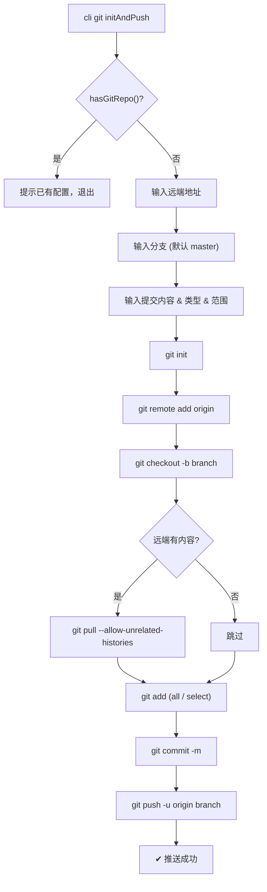

# git initAndPush — 需求分析与实现对照

## 需求概述

为 `git` 命令添加 `initAndPush` 子命令：在当前目录初始化 Git 仓库，添加远程地址，提交并推送。

## 实现对照

| # | 需求 | 实现 | 位置 |
|---|------|------|------|
| 1 | 检测是否已有 Git 配置，有则提示退出 | ✅ `hasGitRepo()` 检测 `.git` 目录 | `initAndPush.ts:9` |
| 2 | 输入远端 Git 地址 | ✅ inquirer input，必填校验 | `initAndPush.ts:14-20` |
| 3 | 输入分支，默认 master | ✅ inquirer input，默认 `master` | `initAndPush.ts:21-26` |
| 4 | 调用已有的 git push 功能 | ⚠️ 未复用 `push.ts`，独立实现：`git init` → `remote add` → `checkout -b` → 检测远程已有内容则 pull → `add .` / 选择文件 → `commit` → `push -u` |

## 差异说明

原始需求要求"调用已有的 git push 功能"（即复用 `services/git/push.ts`），实际实现为独立的完整流程，额外增加了：
- 创建分支（`checkout -b`）
- 检测远程仓库是否有内容并自动 `pull --allow-unrelated-histories`
- 支持选择提交范围（all / select）
- 支持输入提交内容和选择提交类型（复用 `push.ts` 的 `commitTypes` 常量）

调整为独立流程后更符合首次初始化的场景（远端可能为空），复用 push 反而需要处理远程不存在的边界情况。

## 流程图

