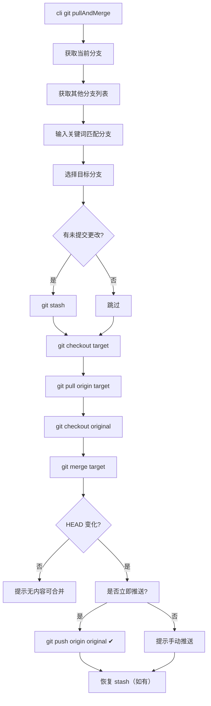

# git pullAndMerge — 需求分析与实现对照

## 需求概述

为 `git` 命令添加 `pullAndMerge` 子命令：选择目标分支，暂存当前更改，拉取目标分支最新代码，切回原分支合并。

## 实现对照

| # | 需求 | 实现 | 位置 |
|---|------|------|------|
| 1 | 用户选择分支 | ✅ 输入关键词匹配已有分支，模糊搜索后选择 | `pullAndMerge.ts:9-44` |
| 2 | 有更改则暂存 | ✅ `git status --porcelain` 检测，`git stash` 暂存 | `pullAndMerge.ts:46-52` |
| 3 | 切换到所选分支，pull | ✅ `git checkout` → `git pull origin targetBranch` | `pullAndMerge.ts:55-59` |
| 4 | 切回原分支，merge | ✅ `git checkout originalBranch` → `git merge targetBranch` | `pullAndMerge.ts:61-67` |
| 5 | 提示用户提交代码 | ✅ 增加推送选项：可立即推送或提示手动推送 | `pullAndMerge.ts:74-89` |

## 差异说明

- **需求 5 扩展**：原始需求仅要求提示用户提交代码，实际增加了是否立即推送的交互确认，选择不推送时才显示提示，更贴合使用场景
- **错误恢复**：增加了异常时的自动切回原分支和暂存恢复（`finally` 块中 `stash pop`）
- **空合并检测**：如果 merge 后 HEAD 未变化，提示"没有需要合并的内容"并提前返回
- 未复用 `pull.ts` 服务函数，直接调用 `spawn('git', ['pull', ...])`，与 pull.ts 的实现一致

## 流程图

