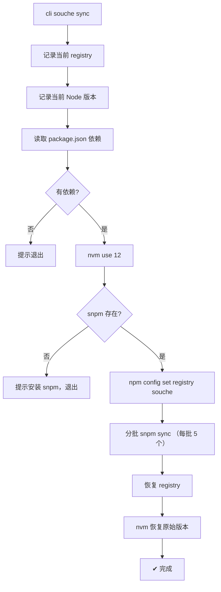

# souche sync — 需求分析与实现对照

## 需求概述

为 `souche` 命令添加 `sync` 子命令：切换 Node 版本，设置内部 registry，分批同步依赖到内部 npm 仓库。

## 实现对照

| # | 需求 | 实现 | 位置 | 状态 |
|---|------|------|------|------|
| 1 | 使用 nvm 切换到 node@12 | ✅ `source ~/.nvm/nvm.sh && nvm use 12` | `sync.ts:32-33` | ✅ |
| 2 | 设置 registry 为 `http://registry.npm.souche-inc.com/` | ✅ `npm config set registry ...` | `sync.ts:38` | ✅ |
| 3 | 检测全局是否有 snpm，无则提示安装 | ✅ `command -v snpm` 检测 | `sync.ts:34-36` | ✅ |
| 4 | 获取所有 dep + devDep | ✅ `readPackageJson()` → `dependencies` + `devDependencies` | `sync.ts:11-15` | ✅ |
| 5 | 分批执行 `snpm sync`，最多 10 个一批，串行 | ⚠️ 见下方差异说明 | `sync.ts:24-28` | ⚠️ |
| 6 | 恢复 registry 和 Node 版本 | ✅ `npm config set registry ${originalRegistry}` + `nvm use ${version}` | `sync.ts:43-45` | ✅ |

## 差异说明

### 1. 分批策略

| 方面 | 需求 | 实现 |
|------|------|------|
| 每批数量 | 最多 10 个 | 5 个（`slice(i, i + 5)`） |
| 执行方式 | 分批串行（等一批完成再下一批） | `&` 后台并行执行 + `wait` |

当前实现用 `snpm sync dep1 dep2 ... &` 将所有批次抛到后台并行，不符合"分批执行，直到执行完"的语义。5 个一批而非 10 个一批也偏保守。

### 2. Shell 注入风险

当前实现通过 `exec(`bash -c '${script}'`)` 执行拼接脚本，不符合代码规范中"禁止 execSync 字符串拼接"的原则。但 sync 场景需要 nvm 环境变量，`spawn` 无法直接加载 `~/.nvm/nvm.sh`，此为已知权衡。

### 3. 错误处理

单个包 sync 失败时，当前实现不会中断流程。需求未明确错误处理策略。

## 推荐改进

- 每批改为 10 个，去掉 `&` 改用 `&&` 或循环等待实现串行分批
- 考虑将 nvm 切换逻辑提取到 `utils/` 中以复用

## 流程图

